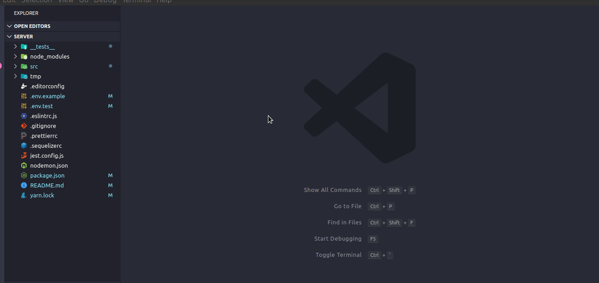

<div align="center" style="padding: 15px;">
  <!-- background: linear-gradient(-29deg, rgb(37, 129, 196) 0%, rgb(45, 65, 127) 100%) -->
  
</div>

<p align="center"><i>Imagem feita pela <a href="https://nagro.com.br/">Nagro</a></i></p>

<h3 align="center">Código desenvolvido para a vaga de backend na Nagro :seedling:</h3>

# RESUMO

API desenvolvida em Node.JS como parte do teste para pleitear a vaga de desenvolvedor *backend* na <a href="https://nagro.com.br/">Nagro</a>

Para visualizar os requisitos, acesso o arquivo TESTE, clicando <a href="https://github.com/KelseyJr/teste-nagro/blob/master/TESTE.md">aqui</a>

# ÍNDICE

- [Instalação](#instalação)
  - [Clonando o repositório](#clonando-o-repositório)
  - [*Download* de dependências](#download-de-dependências)
  - [Configuração das variáveis ambientes](#configuração-das-variáveis-ambientes)
  - [Criando as tabelas do banco de dados](#criando-as-tabelas-do-banco-de-dados)
- [Testes](#testes)
- [Projeto](#projeto)
  - [Parte 1 - Usuários](#parte-1---usuários)
    - [Cadastro de usuário](#cadastro-de-usuário)
    - [Sessão de usuário](#sessão-de-usuário)
    - [Atualização de usuário](#atualização-de-usuário)
  - [Parte 2 - Fazendas](#parte-2---fazendas)
    - [Cadastro de fazenda](#cadastro-de-fazenda)
    - [Atualização de fazenda](#atualização-de-usuário)
    - [Listar todas as fazendas](#listar-todas-as-fazendas)
    - [Listar apenas uma fazenda](#listar-apenas-uma-fazenda)

# Instalação

## Clonando o repositório

Existem duas maneiras de realizar o clone de um repositório, sendo elas: **SSH** e **HTTPS**.

Para clonar utilizando **SSH**, utilize o seguinte comando:
```bash
git clone git@github.com:KelseyJr/teste-nagro.git
```

Para clonar utilizando **HTTPS**, utilize o seguinte comando:
```bash
git clone https://github.com/KelseyJr/teste-nagro.git
```

## *Download* de dependências

Após o clone do repositório, é necessário realizar o *download* das dependências que foram utilizadas nesse projeto.

Para efetuar o *download*, utilize do seguinte comando:
```bash
yarn
```

## Configuração das variáveis ambientes
Para configurar as variáveis ambientes, deve-se criar o arquivo `.env`, copiar as informações contidas
no arquivo `.env.example` e colar no arquivo recém-criado. Após isso, os dados do arquivo gerado devem ser preenchidos.

**OBS:** Por padrão, foi utilizado o banco de dados PostgreSQL. Caso queira usar outro, será necessário realizar as devidas alterações na API.




## Criando as tabelas do banco de dados
Após a configuração das variáveis ambientes, é necessário rodar o *script* responsável pela criação das tabelas no banco de dados.

Para executar o *script*, utilize do seguinte comando:
```bash
yarn sequelize db:migrate
```


# Testes
O seguinte projeto foi construído utilizando-se da metodologia TDD(*Test Driven Development*), em que consiste em criar o teste antes da funcionalidade.

Para rodar os testes, execute o seguinte comando no seu *console*:
```bash
yarn test
```

# Projeto
O projeto foi desenvolvido por partes, para garantir que todos os requisitos fosse atendidos.

## Parte 1 - Usuários
Na parte de usuário, é possível realizar o seu cadastro e a sua atualização, bem como efetuar a sua sessão na API.

### Cadastro de usuário
Segue abaixo as informações da rota de cadastro de usuário.

|Rota autenticada? | Método da rota | Nome da rota | Parâmetros (Request Body) | Retorno |
| :---: | :---: | :---: | :--- | :--- |
|Não | POST | /users | 1 - name: String e obrigatório<br> 2 - email: String, único e obrigatório<br> 3 - cpf: String de tamanho 14(Ex: 754.778.516-60), único e obrigatório<br>4 - password: String e obrigatório | { <br>&emsp;id, <br>&emsp;name,<br>&emsp;email,<br>&emsp;cpf<br> }|

### Sessão de usuário
Segue abaixo as informações da rota de sessão de usuário.

|Rota autenticada? | Método da rota | Nome da rota | Parâmetros (Request Body)| Retorno |
| :---: | :---: | :---: | :--- | :--- |
|Não | POST | /sessions | 1 - email: String e obrigatório<br>2 - password: String e obrigatório | user: { <br>&emsp;id, <br>&emsp;name,<br>&emsp;email,<br>&emsp;cpf<br> },<br>token|

### Atualização de usuário
Segue abaixo as informações da rota de atualização de usuário.

|Rota autenticada? | Método da rota | Nome da rota | Parâmetros (Request Body)| Retorno |
| :---: | :---: | :---: | :--- | :--- |
|Sim | PUT | /users | 1 - name: String e obrigatório<br> 2 - email: String, único e obrigatório<br> 3 - cpf: String de tamanho 14(Ex: 754.778.516-60), único e obrigatório<br>4 - oldPassword: String<br>5 - password: String (obrigatório caso o campo oldPassword seja preenchido)<br>6 - confirmPassword: String (obrigatório caso o campo password seja preenchido)| { <br>&emsp;id, <br>&emsp;name,<br>&emsp;email,<br>&emsp;cpf<br> }|

## Parte 2 - Fazendas
Na parte de fazendas, é possível realizar criar, atualizar, listar todas as fazendas e listar apenas
uma fazenda.

### Cadastro de fazenda
Segue abaixo as informações da rota de cadastro de fazenda.

|Rota autenticada? | Método da rota | Nome da rota | Parâmetros (Request Body)| Retorno |
| :---: | :---: | :---: | :--- | :--- |
|Sim | POST | /farms | 1 - name: String e obrigatório<br> 2 - city: String, único e obrigatório<br> 3 - state: String, único e obrigatório<br>4 - qty_hectares_land: Decimal(double) e obrigatório<br>5 - active: Booleano, sendo *true* como default <br>| { <br>&emsp;id, <br>&emsp;name,<br>&emsp;city,<br>&emsp;state<br>&emsp;qty_hectares_land<br>&emsp;user_id(usuário logado)<br>&emsp;active<br>&emsp;created_at<br>&emsp;updated_at<br> }|

### Atualização de fazenda
Segue abaixo as informações da rota de atualização de fazenda.

|Rota autenticada? | Método da rota | Nome da rota | Parâmetros (Request Body) | Retorno |
| :---: | :---: | :---: | :--- | :--- |
|Sim | PUT | /farms/:id_farm | 1 - name: String e obrigatório<br> 2 - city: String, único e obrigatório<br> 3 - state: String, único e obrigatório<br>4 - qty_hectares_land: Decimal(double) e obrigatório<br>5 - active: Booleano <br>| { <br>&emsp;id, <br>&emsp;name,<br>&emsp;city,<br>&emsp;state<br>&emsp;qty_hectares_land<br>&emsp;user_id(usuário logado)<br>&emsp;active<br>&emsp;created_at<br>&emsp;updated_at<br> }|

#### Parâmetros da rota
|Nome do parâmetro | Tipo do parâmetro | Valor do parâmetro | Exemplo | Obrigatório? |
| :---: | :---: | :---: | :---: | :---: |
| :id_farm | Route params |Inteiro, representando o código da fazenda | /farms/1 | Sim |

### Listar todas as fazendas
Segue abaixo as informações da rota de listagem de todas as fazendas.

|Rota autenticada? | Método da rota | Nome da rota | Parâmetros (Request Body)| Retorno |
| :---: | :---: | :---: | :---: | :--- |
|Sim | GET | /farms/?page=x&per_page=x&active=x | -- | { <br>&emsp;id, <br>&emsp;name,<br>&emsp;city,<br>&emsp;state<br>&emsp;qty_hectares_land<br>&emsp;active<br>&emsp;created_at<br> }|

#### Parâmetros da rota
|Nome do parâmetro | Tipo do parâmetro | Valor do parâmetro | Exemplo | Valor padrão | Obrigatório? |
| :---: | :---: | :---: | :---: | :---: | :---: |
| page | Query params |Inteiro, representando o número da página | page=1 | 1 | Não |
| per_page | Query params |Inteiro, representando a quantidade de registros por página | per_page=5 | 5 |Não |
| active | Query params |Booleano, representando se a fazenda está ativa ou não | active=true | *vazio* |Não |

### Listar apenas uma fazenda
Segue abaixo as informações da rota de listagem de apenas uma a fazenda.

|Rota autenticada? | Método da rota | Nome da rota | Parâmetros (Request Body) | Retorno |
| :---: | :---: | :---: | :---: | :--- |
|Sim | GET | /farms/:id_farm | -- | { <br>&emsp;id, <br>&emsp;name,<br>&emsp;city,<br>&emsp;state<br>&emsp;qty_hectares_land<br>&emsp;active<br>&emsp;created_at<br> }|

#### Parâmetros da rota
|Nome do parâmetro | Tipo do parâmetro | Valor do parâmetro | Exemplo | Obrigatório? |
| :---: | :---: | :---: | :---: | :---: |
| :id_farm | Route params |Inteiro, representando o código da fazenda | /farms/1 | Sim |
